# Build, scan and deploy a docker image securely with Prisma Cloud and GitHub Action.

#### Build Status

#### Objectifs

Github Action pipeline to build and deploy a docker image in an AWS ECR.

Build, Scan and Deploy a simple NodeJS image to an AWS ECR Registry with GitHub Action and Prisma Cloud

The image is tested and validated by Prisma Cloud, to check for vulnerabilities and compliance and authorize or not the deployment to the AWS ECR Registry.

#### Requirements

- **GitHub Account** to create private fork
- **AWS Subscription** with Programmatic Access (**AWS_ACCESS_KEY_ID / AWS_SECRET_ACCESS_KEY** )
- **Prisma Cloud Tenant** with AccessKey & Secret

#### Prerequisites

##### 1. Create a fork of the repository

- Login with your github account
- Open https://github.com/cleypanw/prisma-cloud-secures-ci-image-build and click on Fork

##### 2. Configure GitHub Action Secrets

Open **Settings > Security > Secrets and variables > Actions**

- Secrets

  - **AWS_ACCESS_KEY_ID**

  - **AWS_SECRET_ACCESS_KEY**

  - **PCC_CONSOLE_URL** (Prisma Cloud Console URL)

  - **PCC_PASS** (Prisma Cloud Access Key)

  - **PCC_USER** (Prisma Cloud Secret Key)

    

#### Sequence Diagram

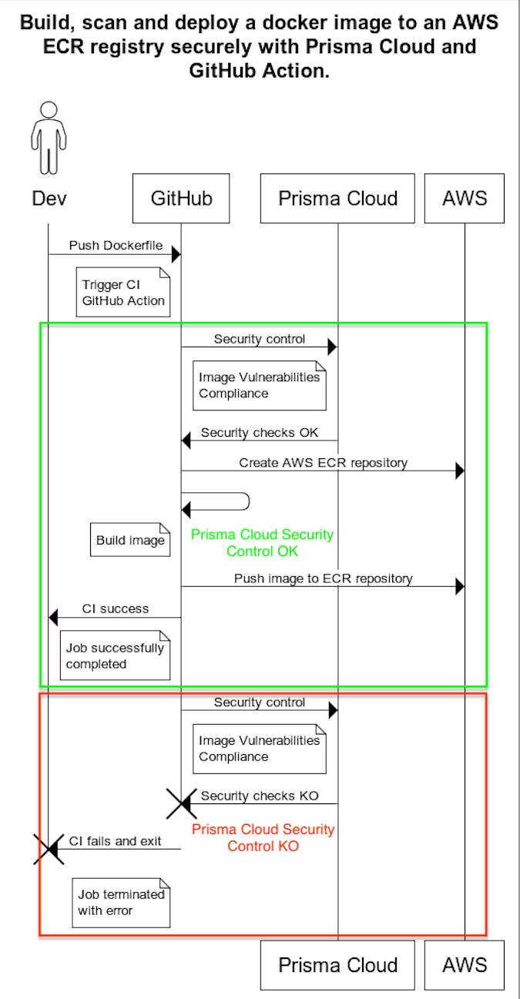

#### High Level Diagram 

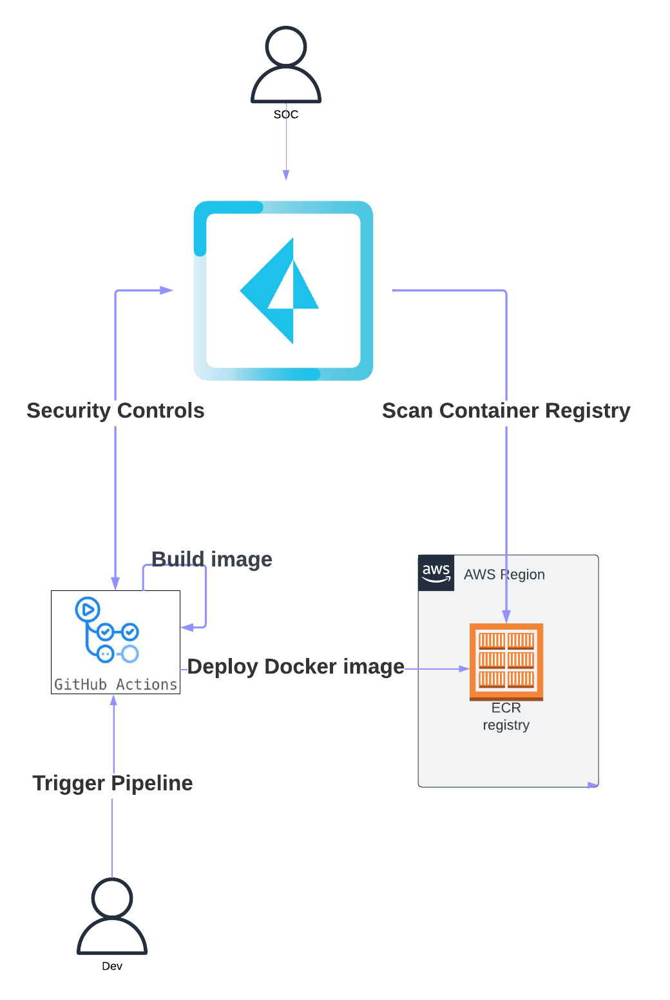

#### Rollout

Build, Scan and Deploy a simple NodeJS image to an AWS ECR Registry with GitHub Action and Prisma Cloud.

This demonstration enables Prisma Cloud to fine-tune the management of new image builds, with the possibility of blocking deployment.

1. **From GitHub** - Update GitHub Action Secrets

   Go to **Settings => Secrets and Variables**

2. **From IDE** - Create Security Issue : example Edit Dockerfile to add SCA issues by using an [old node base image](https://hub.docker.com/_/node/tags) (here node:14)

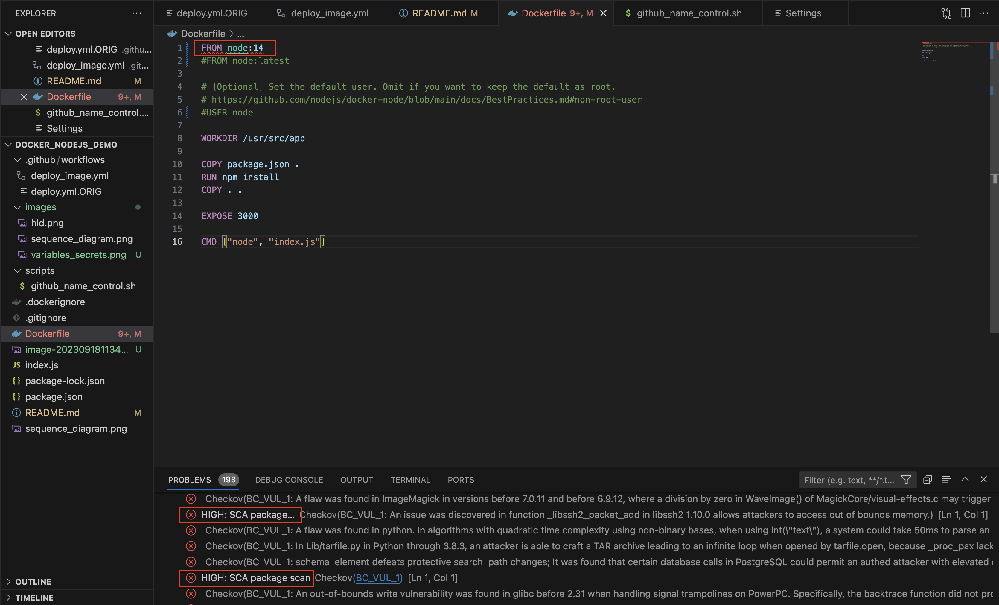

***Note that High alerts are reported directly to the IDE***

3. **From Prisma Cloud Console** -  Add New Vulnerabilities Images CI rule to alert / block  image that are built during CI

   Go to **Compute => Defend => Vulnerabilities => Images => CI**

   Set a Rule Name, Alert and Failure Threshold as following and Save

   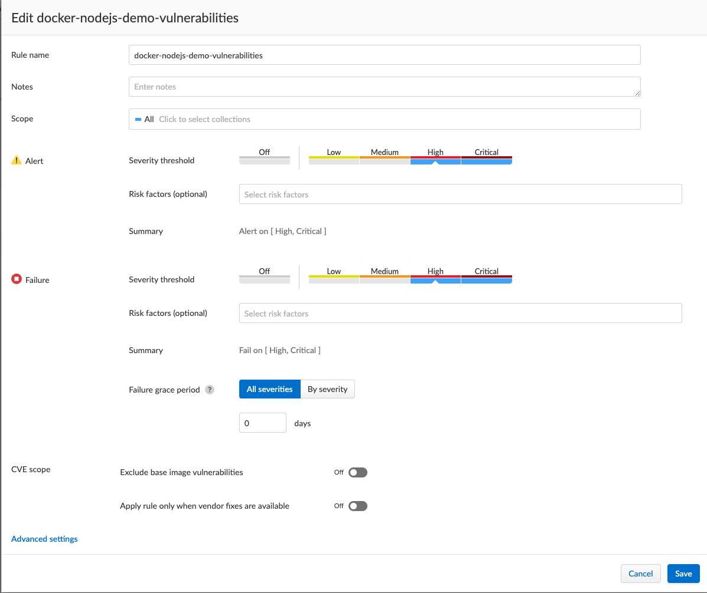

4. **From Compute (IDE or CLI)** - Git commit and Git Push to trigger image building

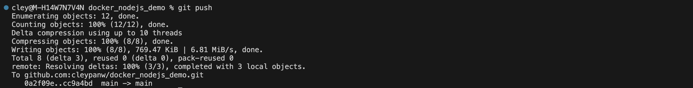

5. **From GitHub** -  Check GitHub action steps and notice Prisma Cloud image scan step has failed

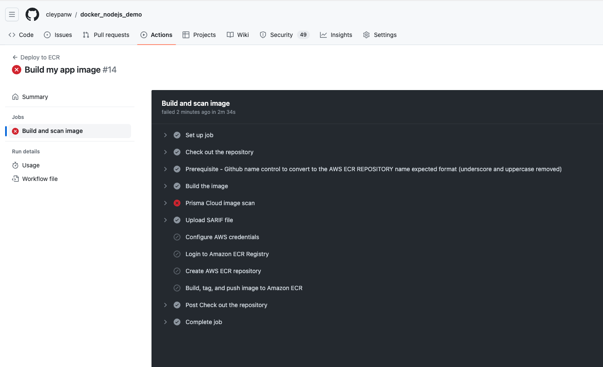

Click on step to view details

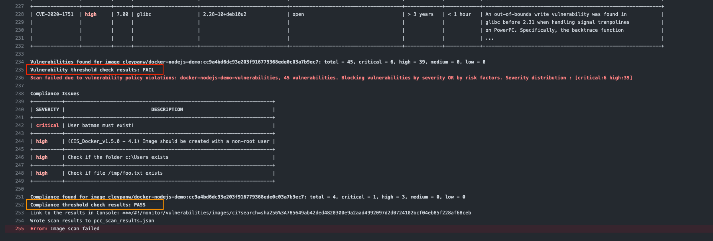

**Note that Vulnerability check result is FAIL and Compliance check is PASS even if critical compliance alerts are lifted.**
**This is because the Hard Fail rule has only been defined for vulnerability High findings.**

6. **From Prisma Cloud Console** - View CI build errors

   Go to Compute => Monitor => Vulnerabilities => Images => CI 

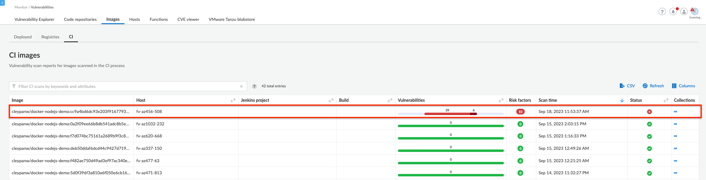

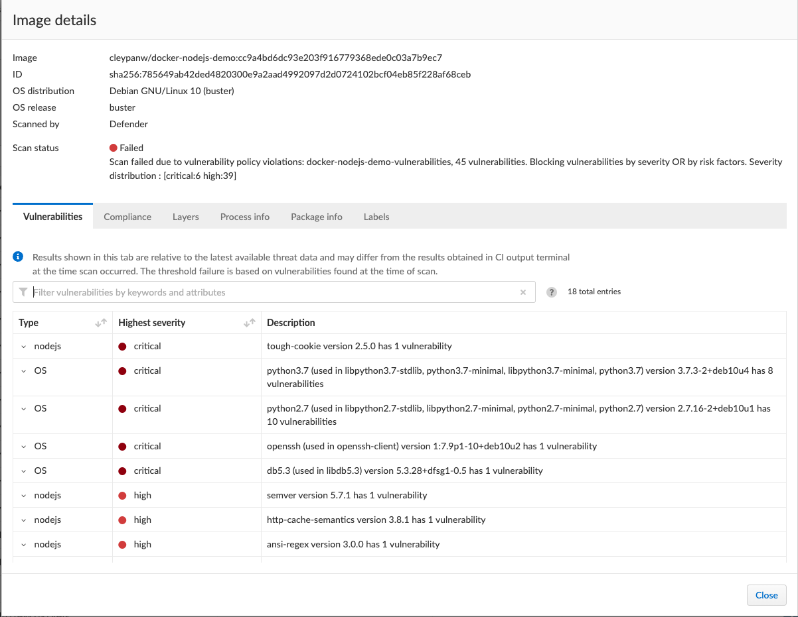

Prisma Cloud prevented the build and deployment of an image with critical vulnerabilities in the image registry.

#### Roll Out - PASS vulnerabilities 

To build the image successfully, you can use node image's Latest tag, there are no more critical vulnerabilities and the build will be authorized by Prisma Cloud.

1. Edit Dockerfile to use node:latest base image

   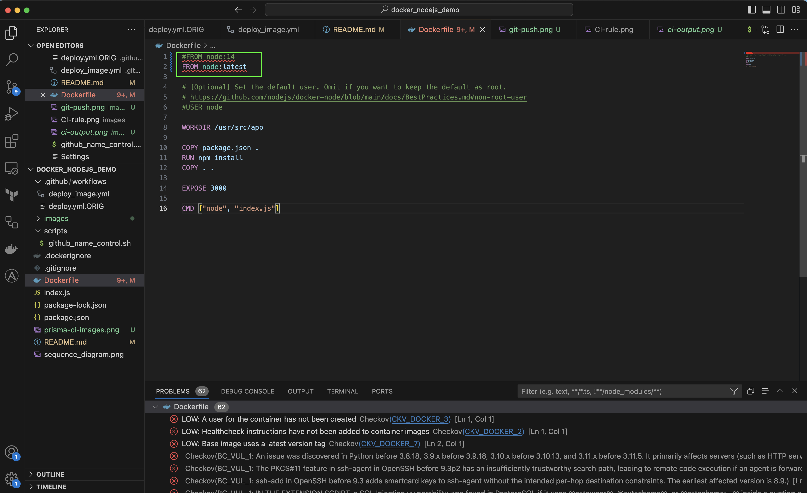

**Note that there are no more high or critical vulnerabilities from IDE**

2. Git commit and Push and check from GitHub action that the build PASS

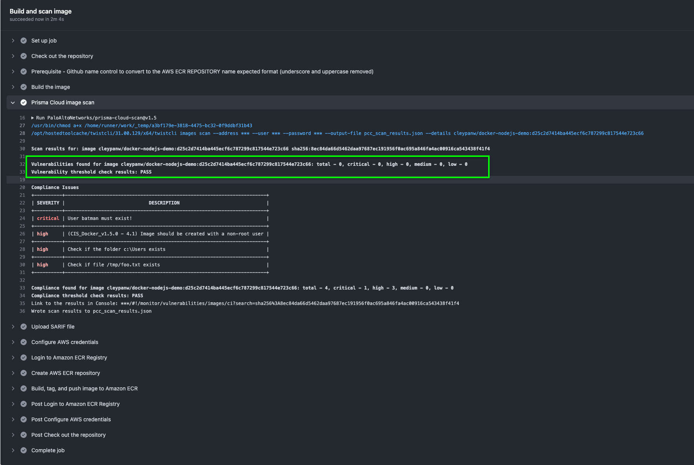

**Note that Vulnerability check result is PASS and Compliance check is PASS even if critical compliance alerts are lifted.**
**This is because the Hard Fail rule has only been defined for vulnerability High findings.**

3. From Prisma Cloud Console - Check CI Build result

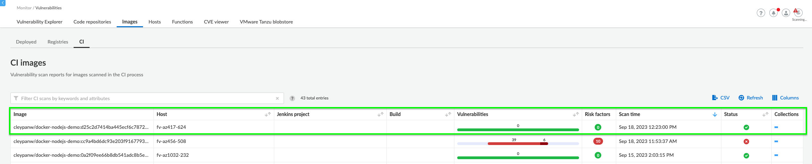

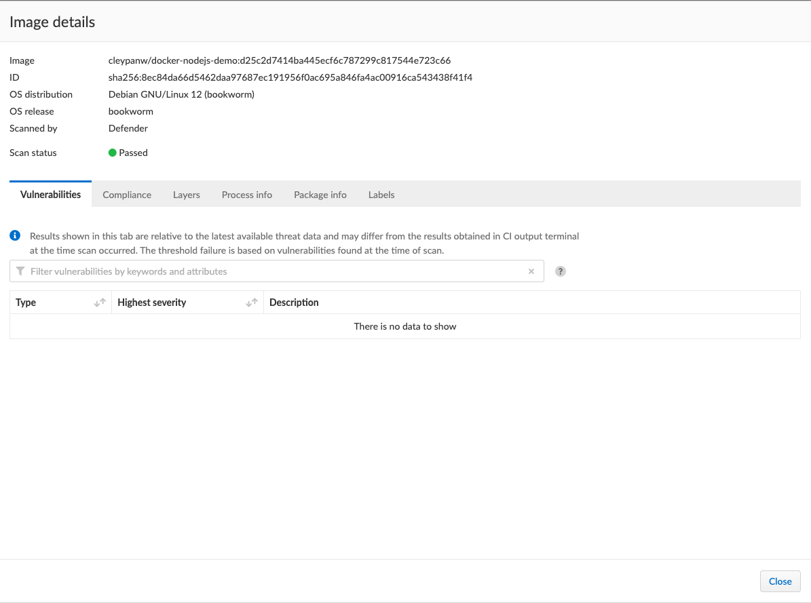

### Author: Christopher LEY - cley@paloaltonetwork.com
